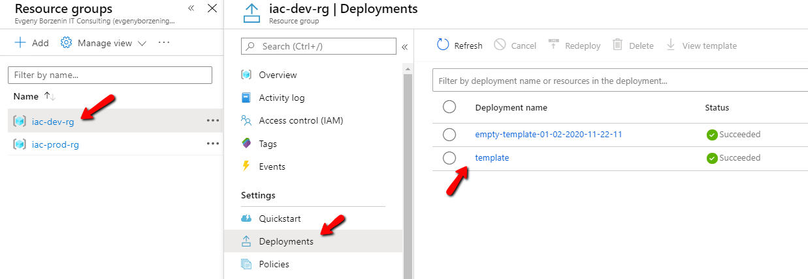

# Lab-02 - create, validate and deploy empty ARM template

## Task #1 - create an empty ARM template

Create new json file called `template.json` under the `lab-02` folder. Copy and paste the following ARM template into this file.

```json
{
    "$schema": "https://schema.management.azure.com/schemas/2019-04-01/deploymentTemplate.json#",
    "contentVersion": "1.0.0.0",
    "parameters": {  
    },
    "variables": {  
    },
    "functions": [  
    ],
    "resources": [  
    ],
    "outputs": {  
    }
}
```

## Task #1 - validate ARM template deployment

In terminal execute the following command from the folder where `template.json` file is located:

```bash
az group deployment validate -g iac-dev-rg --template-file template.json -o table
Result     CorrelationId
---------  ------------------------------------
Succeeded  d508d10e-354f-4f7b-b53d-2d0bd312e392
```

Argument `-g iac-dev-rg` or `--resource-group iac-dev-rg` is a resource group where you deploy your ARM template and `--template-file template.json` is the file containing ARM template.

This command validates ARM template and if it's not valid it will show validation errors. Note that actually `--validate` command is not 100% guaranty that deployment will succeed, but you should know that there is validate option available.

## Task #2 - deploy and empty ARM template

```bash
az group deployment create -g iac-dev-rg --template-file template.json -n empty-template-01-02-2020-11-22-11 -o table
 - Running ..
 Name      ResourceGroup    State      Timestamp                         Mode
--------  ---------------  ---------  --------------------------------  -----------
empty-template-01-02-2020-11-22-11  iac-dev-rg       Succeeded  2020-04-11T20:58:51.354583+00:00  Incremental
```

Argument `-g iac-dev-rg` or `--resource-group iac-dev-rg` is a resource group where you deploy your ARM template and `--template-file template.json` is the file containing ARM template and `-n empty-template-01-02-2020-11-22-11` is deployment name.

Note, it's a good practice to always specify deployment name, make it self explained, so it's easy to understand what was deployed and add a timestamp, so if there were several deployments of the same template they will be shown as a separate deployment unit.

## Checkpoint

You can find all deployments in resource group by running this command:

```bash
az group deployment list -g iac-dev-rg  -o table
Name                                ResourceGroup    State      Timestamp                         Mode       
----------------------------------  ---------------  ---------  --------------------------------  -----------
template                            iac-dev-rg       Succeeded  2020-04-11T20:54:06.360836+00:00  Incremental
empty-template-01-02-2020-11-22-11  iac-dev-rg       Succeeded  2020-04-11T20:58:51.354583+00:00  Incremental
```

or you can go to Azure portal, open your resource group, for instance `iac-dev-rg` and navigate to `Deployments` tab and you will find all your deployments.

