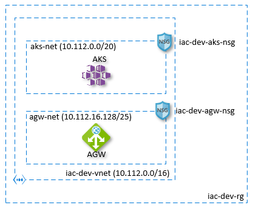

# lab-03 - provisioning of 2 Network Security Groups and one private virtual network

In this lab we will provision the following components of out infrastructure for `dev` environment.



* 2 [network security groups](https://docs.microsoft.com/en-us/azure/virtual-network/security-overview)
* [private virtual network](https://docs.microsoft.com/en-us/azure/virtual-network/virtual-networks-overview) with 2 subnets

Note. AKS and ApplicationGateway are outside of the scope of our labs, but will be covered at the part 2 the workshop...

## Estimated completion time - 20 min

## Useful links

* [Network security groups](https://docs.microsoft.com/en-us/azure/virtual-network/security-overview)
* [What is Azure Virtual Network?](https://docs.microsoft.com/en-us/azure/virtual-network/virtual-networks-overview)
* [ARM template reference for Network Security Group](https://docs.microsoft.com/en-us/azure/templates/microsoft.network/2019-11-01/networksecuritygroups)
* [ARM template reference for virtual Networks](https://docs.microsoft.com/en-us/azure/templates/microsoft.network/2019-11-01/virtualnetworks)
* [ARM 101: Create a Network Security Group](https://github.com/Azure/azure-quickstart-templates/tree/master/101-security-group-create)
* [ARM 101: Virtual Network with two Subnets](https://github.com/Azure/azure-quickstart-templates/tree/master/101-vnet-two-subnets)
* [how to define the order for deploying resources in ARM templates](https://docs.microsoft.com/en-us/azure/azure-resource-manager/templates/define-resource-dependency)
* [resourceId() function](https://docs.microsoft.com/en-us/azure/azure-resource-manager/templates/template-functions-resource#resourceid)

## Task #1 - Network Security Group for AGW subnet

Create ARM template for Network Security Group called `iac-dev-agw-nsg` with 3 rules:

```txt
name: INT-T443-IN-ALLOW
description: ""
protocol: Tcp
sourcePortRange: *
destinationPortRange: 443
sourceAddressPrefix: Internet
destinationAddressPrefix: 10.112.16.128/25
access: Allow
priority: 100
direction: Inbound

name: INT-T80-IN-ALLOW
description: ""
protocol: Tcp
sourcePortRange: *
destinationPortRange: 80
sourceAddressPrefix: Internet
destinationAddressPrefix: 10.112.16.128/25
access: Allow
priority: 101
direction: Inbound

name: AKS-T443-OUT-ALLOW
description: ""
protocol: Tcp
sourcePortRange: *
destinationPortRange: 443
sourceAddressPrefix: 10.112.16.128/25
destinationAddressPrefix: 10.112.0.0/20
access: Allow
priority: 10
direction: Outbound
```

Hint. Try to use `arm-nsg` snippet of [Azure Resource Manager (ARM) Tools](https://marketplace.visualstudio.com/items?itemName=msazurermtools.azurerm-vscode-tools) or check this example [ARM 101: Create a Network Security Group](https://github.com/Azure/azure-quickstart-templates/tree/master/101-security-group-create) for the Network Security Group ARM template syntax.

Validate template

```bash
az group deployment validate --template-file template.json -g iac-dev-rg
```

Deploy ARM template

```bash
az group deployment create -g iac-dev-rg --template-file template.json
```

## Task #2 - create Network Security Group for AKS subnet

Create ARM template for Network Security Group called `iac-dev-aks-nsg` with 1 rule:

```txt
name: AGW-T443-IN-ALLOW
description: ""
protocol: Tcp
sourcePortRange: *
destinationPortRange: 443
sourceAddressPrefix: 10.112.16.128/25
destinationAddressPrefix: 10.112.0.0/20
access: Allow
priority: 100
direction: Inbound
```

Hint. Try to use `arm-nsg` snippet of [Azure Resource Manager (ARM) Tools](https://marketplace.visualstudio.com/items?itemName=msazurermtools.azurerm-vscode-tools) or check this example [ARM 101: Create a Network Security Group](https://github.com/Azure/azure-quickstart-templates/tree/master/101-security-group-create) for the Network Security Group ARM template syntax.

Validate template

```bash
az group deployment validate --template-file template.json -g iac-dev-rg
```

Deploy ARM template

```bash
az group deployment create -g iac-dev-rg --template-file template.json
```

## Task #3 - create new private Virtual Network

Create ARM template for private Virtual Network called `iac-dev-vnet` with 2 subnets and the following specifications:

```txt
VNet name: iac-dev-vnet
addressPrefix: 10.112.0.0/16

Subnets:
    name: aks-net
    addressPrefix: 10.112.0.0/20
    networkSecurityGroup.id: iac-dev-aks-nsg

    name: agw-net
    addressPrefix: 10.112.16.128/25
    networkSecurityGroup.id: iac-dev-agw-nsg
```

Hint. Try to use `arm-nsg` snippet of [ARM template reference for virtual Networks](https://docs.microsoft.com/en-us/azure/templates/microsoft.network/2019-11-01/virtualnetworks) or check this example [ARM 101: Virtual Network with two Subnets](https://github.com/Azure/azure-quickstart-templates/tree/master/101-vnet-two-subnets) for the Virtual Network ARM template syntax.

### Hint #1

Our subnet uses network security group that are described at the same template, therefore we should specify nsg resources as dependencies of vnet resource. Read more about [how to define the order for deploying resources in ARM templates](https://docs.microsoft.com/en-us/azure/azure-resource-manager/templates/define-resource-dependency)

### Hint #2

To specify `nsg` for subnet definition, use `networkSecurityGroup` property an set `id` field by using `resourceId` function. Read more about [resourceId function](https://docs.microsoft.com/en-us/azure/azure-resource-manager/templates/template-functions-resource#resourceid)

Validate template

```bash
az group deployment validate --template-file template.json -g iac-dev-rg
```

Deploy ARM template

```bash
az group deployment create -g iac-dev-rg --template-file template.json
```

## Checkpoint

* You should have one ARM template with 3 resources
* You should see (at least) 3 deployments at the resource groups level

## Next

[Go to lab-04](../lab-04/readme.md)
