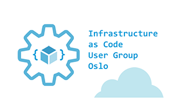

# Workshop agenda

* 17:05 - 17:10 - welcome + practical info
* 17:10 - 17:15 - MS Azure Badges
* Immutable Infrastructure intro
* [lab-01](labs/lab-01/readme.md) - initialize `az cli` environment and create resource groups (xx min)
* [lab-02](labs/lab-02/readme.md) - create storage account ARM template (xx min)
* [lab-03](labs/lab-03/readme.md) - create storage account deployment script (xx min)
* [lab-04](labs/lab-04/readme.md) - create Azure DevOps build pipeline for storage account deployment (xx min)
* [lab-05](labs/lab-05/readme.md) - create storage account release pipeline (xx min)
* [lab-06](labs/lab-06/readme.md) - create Front Door ARM template (xx min)
* [lab-07](labs/lab-07/readme.md) - create YAML based Front Door CI/CD pipeline (xx min)
* [lab-08](labs/lab-08/readme.md) - implement webapp deployment script to active environment (xx min)
* [lab-09](labs/lab-09/readme.md) - create webapp build pipeline (YAML based) (xx min)
* [lab-10](labs/lab-10/readme.md) - create webapp release pipeline (xx min)
