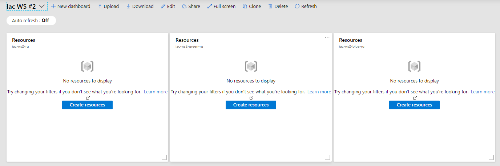

# Lab-01 - initialize `az cli` environment and create resource groups

## Estimated completion time - 10 min

The goals for this lab are:

* initialize your `az cli` environment
* create 2 resource groups for `dev` and `prod` environments
* create Azure portal dashboard at the portal

 Also, please check our [conventions](../../conventions.md) before  you start.

## Task #1 - initialize `az cli` environment

Fist, you need to login to your azure account

```bash
az login
```

You will be redirected to the browser where you will need to login with your azure account. Sometimes, you need manually copy code and enter it at this page [https://microsoft.com/devicelogin](https://microsoft.com/devicelogin). Just follow the instructions.

```bash
$ az login
To sign in, use a web browser to open the page https://microsoft.com/devicelogin and enter the code DMBKTZBJL to authenticate.
```

Next (and this step is optional), you need to set your active subscription.
To get list of available subscriptions, use this command

```bash
az account list -o table
```

To set subscription use this command. You can use both subscription id and subscription name as value for `--subscription` argument.

```bash
az account set --subscription       xxxxxxxx-xxxx-xxxx-xxxx-xxxxxxxxxxxx
or
az account set --subscription subscription_name
```

## Task #2 - create resource group for `blue` environment

Create resource group for `blue` environment.

```bash
az group create -n iac-ws2-blue-rg -l westeurope -o table
```

## Task #3 - create resource group for `green` environment

Create resource group for `green` environment.

```bash
az group create -n iac-ws2-green-rg -l northeurope -o table
```

## Task #4 - create base resource group

```bash
az group create -n iac-ws2-rg -l westeurope -o table
```

## Checkpoint for task #2, #3 and #4

Make sure that your resource groups are created successfully:

```bash
az group list -o table | grep iac-ws2
Name         Location    Status
-----------  ----------  ---------
iac-ws2-blue-rg   westeurope  Succeeded
iac-ws2-green-rg  northeurope  Succeeded
iac-ws2-rg   westeurope  Succeeded
```

## Task #5 (optional) - create Azure portal dashboard

Create Azure portal dashboard for newly created resource groups.

Go to [Azure portal](https://portal.azure.com/) and create new dashboard followed by the [following instructions](https://docs.microsoft.com/en-us/azure/azure-portal/azure-portal-dashboards). Let's call this dashboard `IaC WS #2`.

Find resource group `iac-ws2-rg` and pin it to the dashboard by clicking pin icon  at the top right corner of resource group window next to the close icon .

Repeat the same process with resource groups `iac-ws2-blue-rg` and `iac-ws2-green-rg`.

After you successfully done this, your dashboard should like this:



## Next

[Go to lab-02](../lab-02/readme.md)