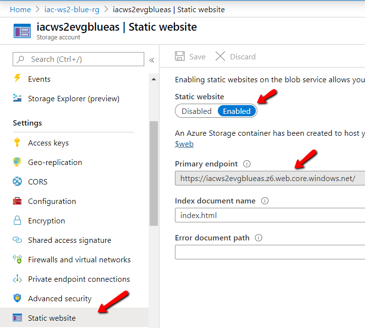

# Lab-03 - create storage account deployment script

You can serve static content (HTML, CSS, JavaScript, and image files) [directly from a container](https://docs.microsoft.com/en-us/azure/storage/blobs/storage-blob-static-website) in an Azure Storage GPv2 account and we will use this functionality to host our test webapp.

Static website hosting is a feature that you have to enable on the storage account and unfortunately it's not possible to do with ARM templates. You can enable it at the portal, but we will use [az storage account](https://docs.microsoft.com/en-us/cli/azure/storage/account?view=azure-cli-latest) commands to enable it.

Therefore our storage account deployment script will do 2 things:

* deploy ARM template
* enable static web hosting feature

## Estimated completion time - x min

## Useful links

* [Storage account overview](https://docs.microsoft.com/en-us/azure/storage/common/storage-account-overview)
* [Static website hosting in Azure Storage](https://docs.microsoft.com/en-us/azure/storage/blobs/storage-blob-static-website)
* [az storage account](https://docs.microsoft.com/en-us/cli/azure/storage/account?view=azure-cli-latest)

## Task #1 - create deployment script

Create `deploy.sh` file followed the following list of requirements:

* the name for the script should be `deploy.sh`
* if should have 2 input parameters

| parameter  | Description |
|---|---|
| environment | environment (blue/green) |
| release | release name, will be set by CI/CD pipeline to tag resource with release number it was provisioned from |

* script should build storage account name and send it as an ARM template parameter
* script should use parameter file for the specified environment
* script should enable static website feature with the following command

Here is my version of this script, but feel free to implement your own version.

```bash
#!/usr/bin/env bash
environment=$1
release=$2

timestamp=`date "+%Y%m%d-%H%M%S"`
storageAccountName="iacws2evg${environment}as"
resourceGourpName="iac-ws2-${environment}-rg"
deploymentName="iac-ws2-sa-${timestamp}"

echo -e "Deploying storage account ${storageAccountName} to resource group ${resourceGourpName}"
az deployment group create -g iac-ws2-${environment}-rg \
        --template-file template.json \
        --parameters @parameters-${environment}.json \
        --parameters storageAccountName=${storageAccountName} \
        --parameters release=${release} \
        --name ${deploymentName} -o table

echo -e "Enabling static-website feature for storage account ${storageAccountName}"
az storage blob service-properties update --account-name ${storageAccountName} --static-website  --index-document index.html
```

Try to deploy storage account to the `blue` environment:

```bash
./deploy.sh blue local-run
```

## Task #5 - commit and push your changes

```bash
git add .
git comment -m "Finish lab-03"
git push
```

## Checkpoint

You should now have storage account provisioned at `iac-ws2-blue-rg` and static web site should be enabled.

You can check `Static website` settings at at the portal and it should be `Enabled`.



You should have no changes at your repository

```bash
git status
...
nothing to commit, working tree clean
```

## Next

[Go to lab-04](../lab-04/readme.md)