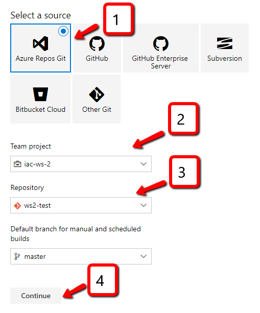
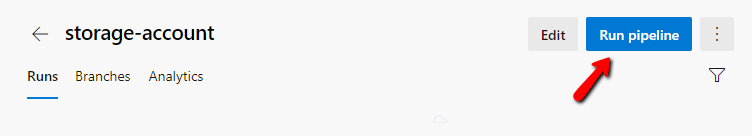
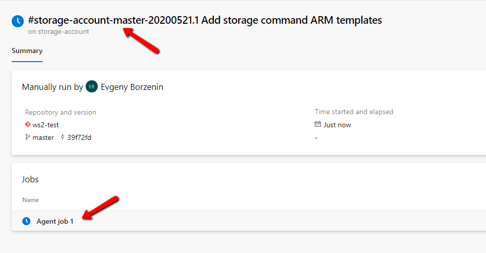

# Lab-04 - create Azure DevOps build pipeline for storage account deployment

Now that we have ARM template and deployment script, we will start setting up automated deployment pipeline. It will consist of 2 steps:

* build - during this step we will collect all files needed to provision storage account ans publish them as Azure DevOps artifact
* release - that will download the artifacts and provision them to the selected environment.

The gaol for this lab is to implement build pipeline for storage account infrastructure.

There are 2 ways you can implement build pipelines in Azure DevOps: classic (aka clickops) and YAML based. To learn both we will implement both and for storage account, we will use the classic way.


## Estimated completion time - x min

## Useful links

* [Use Azure Pipelines](https://docs.microsoft.com/en-us/azure/devops/pipelines/get-started/pipelines-get-started?view=azure-devops)
* [Create your first pipeline](https://docs.microsoft.com/en-us/azure/devops/pipelines/create-first-pipeline?view=azure-devops&tabs=java%2Cyaml%2Cbrowser%2Ctfs-2018-2)
* [Create a build pipeline with Azure Pipelines](https://docs.microsoft.com/en-us/learn/modules/create-a-build-pipeline/)
* [Azure Pipelines documentation](https://docs.microsoft.com/en-us/azure/devops/pipelines/?view=azure-devops)
* [YAML schema reference](https://docs.microsoft.com/en-us/azure/devops/pipelines/yaml-schema?view=azure-devops&tabs=schema%2Cparameter-schema)

## Task #1 - create `storage-account` build pipeline

We want our build pipeline to do the following things:

* publish storage account ARM templates and scripts as an Azure DevOps artifact that will be accessible from the release pipeline
* only trigger build pipeline if there are some changes at the folder containing storage account ARM templates
* build number should use the following naming convention: `storage-account-$(SourceBranchName)-$(Date:yyyyMMdd)$(Rev:.r)`

Here is step-by-step guide how to do it:

### Create new pipeline


### Since we want to create classic build, choose `Use the classic editor`


### Configure source code options



* Since our git repository hosted under Azure DevOpe, select `Azure Repos Git`.
* Select your Azure DevOps project
* Select your repository
* (optional) If you want to build from other branch, select branch
* Click `Continue`

### Select template


We want to build our build from scratch, therefore select `Empty job`

### Configure build agent specifications


We want to use `ubuntu-16.04`

### Add `Copy files` task


* Select `Agent job 1`
* Click `+` icon
* Type `copy` in the search field
* From the list select task called `Copy files` and click `Add`

### Configure `Copy files` task


* Give a task a name, for example, `Copy storage account ARM templates`
* Specify source folder path, if you follow our convention, the path will be `infrastructure/arm/01-storage-account`, but you may have a different path. You can also you can use UI to navigate through your git repo by clicking this icon , next to the `Source Folder` field
* Specify your content filtering rules. For our case, we can use the default one.
* Specify `Target Folder` where files will be copied to. We will use the default one `$(Build.ArtifactStagingDirectory)`

### Add `Publish build artifacts` task


* Select `Agent job 1`
* Click `+` icon
* Type `publish build` in the search field
* From the list select task called `Publish build artifacts` and click `Add`

### Configure `Publish build artifacts` task


* Give a task a name, for example, `Publish storage account ARM templates artifacts`
* Specify `Path to publish` - the folder or file path to publish. We will use the path where we copied our ARM template files at `Copy files` step - $(Build.ArtifactStagingDirectory)
* Specify `Artifact name` - the name of the artifact to create in the publish location.

### Configure build Triggers


* Enable continuous integration
* Select to changes from what branch we want to trigger this build. We will use `master` branch
* Add `Path filters`


* Specify to the changes from what folder we want to trigger this build. We will use `master`. We only want this build to start when storage account ARM template, parameters or script files are changed, therefore we use `infrastructure/arm/01-storage-account`. If you have different folder structure, please adjust this value.

### Configure build number format


* We will use `storage-account-$(SourceBranchName)-$(Date:yyyyMMdd)$(Rev:.r)` pattern for build number

### Give your build a name


We will use `storage-account` as a build name

### Save your build pipeline


You can either just `Save` or you `Save & queue`

Pipeline is ready and you can find it under the list of pipelines. Since we never run this pipeline, you will only find it under `All` tab


## Task #2 - run pipeline manually



Open build and click `Run pipeline`.


You can specify from what branch you want to build. We use `master`, so just click `Run`

Now build start running. You can check that the name of the build is follows your build naming convention. In my case it's `storage-account-master-20200521.1`.



You can now check build logs, by clicking to `Agent job 1` link...


Here at the left pane you can  select different build tasks and you will see logs at the right panel. In this example, I selected `Copy storage account ARM templates` and it shows what files were copied.

Now we can check if artifacts were published


and we can check what files are included into the artifact


## Task #3 - start pipeline by trigger

Now let's check that our trigger is configured properly. If you apply any change to any of the files inside the `infrastructure/arm/01-storage-account` folder. For example, add extra line to the end of `template.json` file, then commit and push change to git.

```bash
$ git status
On branch master
Your branch is up to date with 'origin/master'.

Changes not staged for commit:
  (use "git add <file>..." to update what will be committed)
  (use "git checkout -- <file>..." to discard changes in working directory)

        modified:   infrastructure/arm/01-storage-account/template.json
```

```bash
git add .
git commit -m "Testing build trigger"
git push
```

Go to Azure DevOps and check that `storage-account` build is running...


## Checkpoint

You now should have build pipeline `storage-account` that publishes storage account ARM templates and scripts as Azure DevOps artifacts and triggers automatically every time you apply changes to storage account ARM templates, parameters or deployment script.

You should have no changes at your repository

```bash
git status
...
nothing to commit, working tree clean
```

## Next

[Go to lab-05](../lab-05/readme.md)