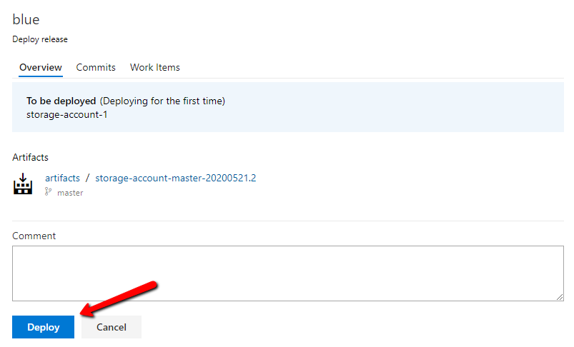

# Lab-05 - create storage account release pipeline 

At this point, we have ARM template and build pipeline that pushes new artifacts every time we do any changes to storage account ARM templates or scripts. Now let's setup the release pipeline that will get artifacts from `storage-account` build and deploy them to `blue` environment. 

For this exercise we will still use classic release pipeline.


## Estimated completion time - x min

## Useful links

* [Release pipelines](https://docs.microsoft.com/en-us/azure/devops/pipelines/release/?view=azure-devops)
* [Create a release pipeline in Azure Pipelines](https://docs.microsoft.com/en-us/learn/modules/create-release-pipeline/)
* [Use Azure Pipelines](https://docs.microsoft.com/en-us/azure/devops/pipelines/get-started/pipelines-get-started?view=azure-devops)
* [Azure Pipelines documentation](https://docs.microsoft.com/en-us/azure/devops/pipelines/?view=azure-devops)

## Task #1 - create `storage-account` release pipeline

We want our release pipeline to do the following things:

* Download ARM templates artifacts from the `storage-account` build
* Use `deploy.sh` script from artifact and deploy storage account ARM template to `blue` environment
* Send release number as a parameter to `deploy.sh` script

### Create new release pipeline


* select `Releases` under `Pipelines` section
* Click `New` and select `New release pipeline`

### Select `Empty job` template


We want to configure everything manually, therefore use `Empty job`

### Add reference to `storage-account` build artifacts


* Select `Add an artifact` item
* Select `Build` as a source type
* Select you Azure DevOps project
* Select source build pipeline. In our case use `storage-account`
* Set the `Source alias` to `artifacts`
* Click `Add`

### Configuring stage


* Click to `Stage 1`


* Rename stage to `blue`


* Use `ubuntu-16.04` for release agent

### Add `Azure cli` task


* Select `Agent job` panel and click to `+` icon
* Type `az cli` in the search field
* Select `Azure cli` task and click `Add`

### Authorize integration between Azure DevOps and Azure account 


* Open `Azure subscription` drop down list and select your Azure subscription (the one where your resource groups are if you have several subscriptions)


* Click `Authorize`

You will be redirected to the Azure AD login window where you will need to authenticate yourself with your Azure account.

### Configure Azure CLI task


* Give the task a name, for example `Provision storage account`
* Select `Azure subscription` from `Available Azure Service Connections`
* Select `Shell` as a `Script Type`
* Select `Script path` as `Script Location`
* Specify path to `deploy.sh` from the artifact. If you follow conventions we use, it will be `$(System.DefaultWorkingDirectory)/artifacts/arm/deploy.sh`. You can navigate through artifact file by clicking to  icon.
* Set `blue $(Release.ReleaseName)` as a `deploy.sh` script input parameters
* Set `$(System.DefaultWorkingDirectory)/artifacts/arm` as a working directory (adjusted it to your folder structure if you don't follow our conventions)

### Configure Continuos deployment options


* Navigate to `Pipeline` tab
* At the artifacts section, click at `Continuous deployment trigger` icon
* Enable `Continuous deployment trigger`
* Add `master` branch at `Build branch filters`

### Configure Stage start deployment trigger


* Select `blue` stage
* Click at `Pre-deployment conditions` icon
* Under the `Triggers` section, select `Manual only` option

### Set release name format


* Give the release a name, for example `storage-account`
* Go to `Òptions` and set `Release name format` to `storage-account-$(rev:r)`
* Click `Save`

## Task #2 - create new release

Create new release by clicking `Create release` link


Select what build you want to release and click `Create`


New release is now created and you can open it by follow the link.


Since we configured our release, we need to manually deploy it to the selected stage. Select `blue` stage and click `Deploy`


You can add release comment or just click `Deploy`



Now release started and you can check the logs. Open logs by clicking `Logs` button.


You can find release in the release list.


## Task #3 - check CI/CD integration

At this point we have almost 100% automated CI/CD pipeline. `storage-account` build is automatically starting with every commit to the ARM templates and release pipeline is configured to automatically start after each new successful build. 

Let's test it.

* Change storage account ARM template
* Commit and push changes

```bash
git add .
git commit -m "Testing CI/CD"
git push
```

* Go to Azure DevOps and check that `storage-account` build is running...


* Wait until build is finished and check that new `storage-account` release was created


## Checkpoint

Now we have both build and release pipelines and we can deploy our infrastructure changes both from local PC and via Azure DevOps pipelines. Note, it's the same script we use both at pipelines and locally.

You should have no changes at your repository

```bash
git status
...
nothing to commit, working tree clean
```

## Next

[Go to lab-06](../lab-06/readme.md)