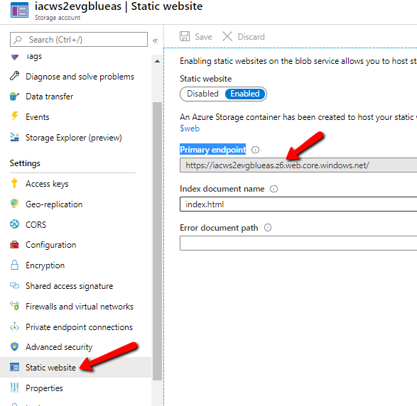

# Lab-06 - create Front Door ARM template

The goal of this lab is to implement Front Door ARM template, validation and deployment scripts.

## Estimated completion time - 10-15 min

## Useful links

* [What is Azure Front Door?](https://docs.microsoft.com/en-us/azure/frontdoor/front-door-overview)
* [Azure Front Door documentation](https://docs.microsoft.com/en-us/azure/frontdoor/)
* [Quickstart: Create a Front Door for a highly available global web application](https://docs.microsoft.com/en-us/azure/frontdoor/quickstart-create-front-door)
* [Azure Resource Manager deployment model templates for Front Door](https://docs.microsoft.com/en-us/azure/frontdoor/front-door-quickstart-template-samples)
* [Create a basic Front Door](https://azure.microsoft.com/en-gb/resources/templates/101-front-door-create-basic/)

## Task #1 - create folder structure

Create the following folder structure under your git repository:

```txt
infrastructure
    arm
        02-front-door
```

## Task #2 - implement Front Door ARM template

Create `template.json` file inside `02-front-door` folder and implement Front Door ARM template with the following requirements:

* it should contain one frontend endpoint
* it should contain one backend pool with 2 endpoints
* endpoint #1 should point to storage account deployed to `blue` environment
* endpoint #2 should point to storage account deployed to `green` environment
* only one endpoint can be enabled at the time, if `blue` is enabled, `green` should be disabled and vice verso
* active environment should be passed as an optional parameter
* the backend pool name should be the same as the name of the active environment
* Azure DevOps release pipeline id should passed as a `release` parameter with default value set to `local`
* the Front Door name should be unique and should follow [naming convention](../../conventions.md). Use your user signature to make sure we avoid conflicts with other participants instance names

Feel free to create Front Door instance manually at the portal or use my version of the [template](template.json).

Some comments regarding template variables:

* `fdName` variable has to be unique, because it will be part of the Front Door DNS name
* `webBlueHost` and `webGreenHost` should point towards your storage account `Primary endpoint`


## Task #3 (optional) - create validate.sh script

```bash
#!/usr/bin/env bash

az deployment group validate -g iac-ws2-rg \
        --template-file template.json \
        --parameters release="local" \
        -o table
```

Validate your template:

```bash
./validate.sh
```

## Task #4 - create deployment script

Create `deploy.sh` script with one input parameter - `release`

```bash
#!/usr/bin/env bash
release=$1

timestamp=`date "+%Y%m%d-%H%M%S"`
resourceGroupName="iac-ws2-rg"
deploymentName="fd-${timestamp}"

echo -e "Deploying Front Door ${storageAccountName} to resource group ${resourceGroupName}"
az deployment group create -g ${resourceGroupName} \
        --template-file template.json \
        --parameters release=${release} \
        --name ${deploymentName} -o table

```

Try to deploy your Front Door:

```bash
./deploy.sh local
```

## Task #5 - commit and push your changes

```bash
git add .
git comment -m "Finish lab-06"
git push
```

## Checkpoint

You should have no changes at your repository

```bash
git status
...
nothing to commit, working tree clean
```

## Next

[Go to lab-07](../lab-07/readme.md)