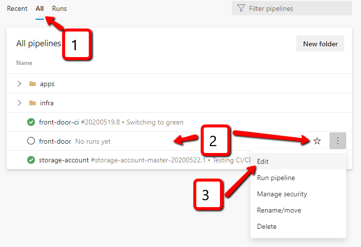
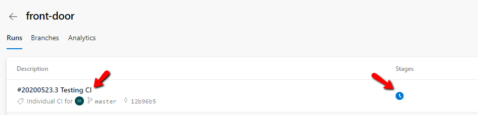

# Lab-07 - create YAML based Front Door CI/CD pipeline

Storage account CI/CD pipelines were implemented as classic Azure DevOps pipelines. To give you hands-on feeling what it takes to work with YAML based pipelines, let's implement Front Door pipeline using YAML syntax.


## Estimated completion time - x min

## Useful links

* [YAML schema reference](https://docs.microsoft.com/en-us/azure/devops/pipelines/yaml-schema?view=azure-devops&tabs=schema%2Cparameter-schema)
* [Use Azure Pipelines](https://docs.microsoft.com/en-us/azure/devops/pipelines/get-started/pipelines-get-started?view=azure-devops)
* [What is Azure Pipelines?](https://docs.microsoft.com/en-us/azure/devops/pipelines/get-started/what-is-azure-pipelines?view=azure-devops)
* [Key concepts for new Azure Pipelines users](https://docs.microsoft.com/en-us/azure/devops/pipelines/get-started/key-pipelines-concepts?view=azure-devops)
* [Multi-stage pipelines user experience](https://docs.microsoft.com/en-us/azure/devops/pipelines/get-started/multi-stage-pipelines-experience?view=azure-devops)

## Task #1 - create empty YAML based pipeline

### Create new pipeline


### Select where is your source code located


### Select your repository


### Select `Starter pipeline`


### Configure your pipeline


* Set the name of the pipeline to `front-door-pipeline.yaml`
* Remove all content, we will implement it from the IDE
* Save pipeline


* Optionally change commit message and `Save`

### Rename pipeline


* Navigate to `All`
* Select your newly created pipeline. It will have the same name as your Repository name
* Select `Rename/move`


* Set the new name, for example, `front-door`
* (Optional) Change folder
* Click `Save`

Now Azure DevOps committed new file into your repo and you can find it there.

 

Get this file to your local repo

```bash
git pull
```


Now when you have pipeline yaml file in local repo, you can work with it in VS Code.

## Task #2 - configure Front Door pipeline from the portal

For the Front Door resource we want  to have 100% automated pipeline and all changes done at thr ARM templates or scripts, should be immediately deployed. We don't need to publish templates and scripts as Azure DevOps artifacts because we can always trace back to git repo what was actually deployed. Therefore, we only need to configure:

* [trigger](https://docs.microsoft.com/en-us/azure/devops/pipelines/yaml-schema?view=azure-devops&tabs=schema%2Cparameter-schema#triggers) - specify when pipeline should start
* `az cli` task that will deploy Front Door ARM template

Here is the `trigger` configuration example

```yaml
trigger:
  branches:
    include:
    - master
  paths:
    include:
    - infrastructure/arm/02-front-door/*
```

It tells Azure DevOps that this pipeline should start when there is a change at any file under `infrastructure/arm/02-front-door/` in `master` branch.

Now let's get back to Azure DevOps and edit `front-door` pipeline



* In the edit window, add trigger section to the `front-door-pipelines.yml`.
* Add `steps:` element
* In `Tasks` list, type `az cli` and select `Azure CLI` task


### Configure Azure CLI task


* Select your Azure Service connection associated with your Azure Subscription
* Select `Script Type` as `Shell`
* Select `Script location` as `Script path`
* Set `Script path` to your Front Door deploy.sh script. If you follow our naming convention, it will be `infrastructure/arm/02-front-door/deploy.sh`
* Open `Advanced` section
* Set `Working Directory` to the folder, where front door deploy.sh script is located. If you follow our naming convention, it will be `infrastructure/arm/02-front-door/`
* Click `Add`

### Save pipeline


* Double check that everything looks correct and click `Save`


* Edit commit message if needed and click `Save`

### Pull changes to your local repo

```bash
git pull
```

## Task #2 - configure Front Door pipeline from the VS Code

If you don't what to click at the portal, you can edit your `front-door-pipeline.yaml` file and just paste this yaml into it

```yaml
trigger:
  branches:
    include:
    - master
  paths:
    include:
    - infrastructure/arm/02-front-door/*
steps:
- task: AzureCLI@2
  displayName: 'Deploy Front Door'
  inputs:
    azureSubscription: 'YOU-AZURE-DEVOPS-SERVICE-CONNECTION'
    scriptType: bash
    scriptPath: 'infrastructure/arm/02-front-door/deploy.sh'
    arguments: '$(Build.BuildNumber)'
    workingDirectory: 'infrastructure/arm/02-front-door'
```

Replace `YOU-AZURE-DEVOPS-SERVICE-CONNECTION` with your service connection. adjust `scriptPath` and `workingDirectory` if needed and push you changes.

```bash
git add .
git commit -m "Configuring front door pipeline"
git push
```

## Task #4 - run `front-door` pipeline

To run the pipeline, you can either find it at the pipeline list and click `Run pipeline` from the context menu


or, if you open pipeline, you can `Run pipeline` from there


You can optionally select from what branch you want to get source code form, select one and click `Run`


### Grant permission to Service Connection

Most likely you will be asked to grant permission for your pipeline to access `Service Connection`. Click `View``.


Then click `Permit`


 and `Permit`


After that pipeline will start and you can check the logs


## Task #5 - test CI trigger

Now test that trigger is configured properly.

* Change something at the Front Door ARM template
* Commit changes 

```bash
git add .
git commit -m "Testing CI trigger"
git push
```

and check that new build has started...



## Task #6 - commit and push any un-committed changes

```bash
git add .
git comment -m "Finish lab-07"
git push
```

## Checkpoint

Now we have `front-door` YAML based CI pipeline that automatically deploys Front Door changes.

You should have no changes at your repository

```bash
git status
...
nothing to commit, working tree clean
```

## Next

[Go to lab-08](../lab-08/readme.md)
