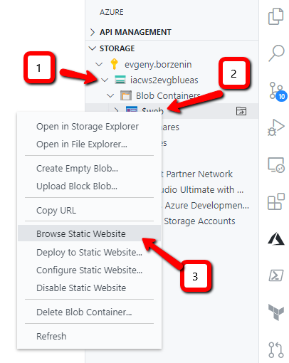
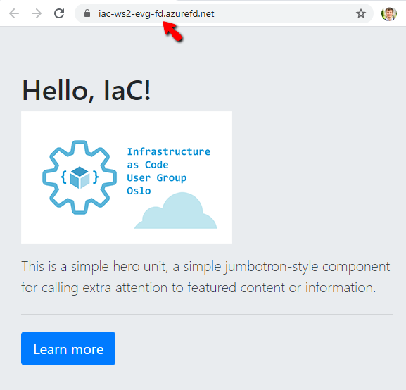

# Lab-08 - implement webapp deployment script to active environment

Now it's time to work with our web application. Our webapp is just a static web site with 2 html pages with images. Let's use the following folder and files structure:

```txt
infrastructure
src
  webapp
    images
      logo.png
    index.html
  deploy-active.sh
  deploy-vnext.sh
```

CI/CD pipeline will consists of 2 components:

* Build that publishes static content as Azure DevOps artifacts
* Release that deploys selected artifact to selected environment

There is only one active environment available and Front Door backend is configured towards this environment. When we need to apply some infrastructure changes, we provision new environment, we should be able to deploy our webapp to new environment using the same CI/CD pipeline. When we tested our webapp in new infrastructure and ready to switch environments, we set active environment at Front Door template and the rest is done automatically with our pipelines.

Let's introduce some concepts for this lab.

**Active environment** - current active environment where webapp CI/CD pipeline will automatically deploy changes at the webapp

**vNext environment** - new fully functioning environment where we test new infrastructure. This environment is not yet available for users, but available for testing and experimentation.

`Active` and `vNext` environments are rotating with each switch. For example, if now the active environment is `blue`, then `vNext` will be `green`. When `vNext` become an `active` environment after the switch, then `green` is `active` and `vNext` will be `blue`, etc...

The gaol for this lab is to implement deployment script that will deploy our webapp to the active environment.

## Estimated completion time - x min

## Useful links

* [az network front-door](https://docs.microsoft.com/en-us/cli/azure/ext/front-door/network/front-door?view=azure-cli-latest)
* [az storage](https://docs.microsoft.com/en-us/cli/azure/storage?view=azure-cli-latest)
* [Backends and backend pools in Azure Front Door](https://docs.microsoft.com/en-us/azure/frontdoor/front-door-backend-pool)
* [Static website hosting in Azure Storage](https://docs.microsoft.com/en-us/azure/storage/blobs/storage-blob-static-website)
* [Host a static website in Azure Storage](https://docs.microsoft.com/en-us/azure/storage/blobs/storage-blob-static-website-how-to?tabs=azure-portal)
* [Azure Storage for Visual Studio Code](https://marketplace.visualstudio.com/items?itemName=ms-azuretools.vscode-azurestorage)

## Task #1 (optional) - install Azure Storage for Visual Studio Code plugin

To improve your development experience, I suggest you to install [Azure Storage for Visual Studio Code plugin](https://marketplace.visualstudio.com/items?itemName=ms-azuretools.vscode-azurestorage). It will help you to explore and manage your storage account blog.

## Task #2 - create folder structure for our webapp

Implement the following folder structure under your Azure DevOps working repository

```txt
infrastructure
src
  webapp
    images
      logo.png
    index.html
  deploy-to-active.sh
  deploy-to-vNext.sh
```

You can use `index.html` and `logo.png` from this lab, or you can amaze yourself with your HTML skills :)

## Task #3 - create `deploy-to-active.sh` script

Our deployment script to active environment should fullfil the following requirements:

* it should be located inside `src` folder
* it should pass path to the webapp as input parameter
* it should identify what is the active environment
* deploy webapp to the active storage account blob

When we implemented Front Door logic we use a convention that backend pool name should be the name of the active environment. We will use it to identify what is the name of active environment. Since there is only one backend pool, we can use [az network front-door backend-pool list](https://docs.microsoft.com/en-us/cli/azure/ext/front-door/network/front-door/backend-pool?view=azure-cli-latest#ext-front-door-az-network-front-door-backend-pool-list) command to get backend pool' name.

To upload webapp content we will use [az storage blob upload-batch](https://docs.microsoft.com/en-us/cli/azure/storage/blob?view=azure-cli-latest#az-storage-blob-upload-batch) command.

The final version of the script may look like this:

```bash
#!/usr/bin/env bash
# Usage:
#   ./deploy-to-active.sh webapp

webappFolder=$1

echo -e "Install front-door extension"
az extension add -n front-door

frontDoorName="iac-ws2-evg-fd"
frontDoorResourceGroupName="iac-ws2-rg"

echo -e "Get active environment name from Front Dore instance"
activeEnvironment=$(az network front-door backend-pool list -f ${frontDoorName} -g ${frontDoorResourceGroupName} --query [0].name -o tsv)
storageAccountName="iacws2evg${activeEnvironment}as"

echo -e "Deploying webapp to ${storageAccountName}"
az storage blob upload-batch \
    -s ${webappFolder} \
    -d \$web \
    --account-name ${storageAccountName}
```

## Task #4 - deploy your webapp

```bash
./deploy-to-active.sh webapp
No connection string, account key or sas token found, we will query account keys for your storage account. Please try to use --auth-mode login or provide one of the following parameters: connection string, account key or sas token for your storage account.
Finished[#############################################################]  100.0000%
[
  {
    "Blob": "https://iacws2evgblueas.blob.core.windows.net/$web/index.html",
    "Last Modified": "2020-05-24T20:49:36+00:00",
    "Type": "text/html",
    "eTag": "\"0x8D80023F837B780\""
  },
  {
    "Blob": "https://iacws2evgblueas.blob.core.windows.net/$web/images/logo.png",
    "Last Modified": "2020-05-24T20:49:36+00:00",
    "Type": "image/png",
    "eTag": "\"0x8D80023F847C0F9\""
  }
]
```

## Task #5 - test your website

Navigate to your website. You can find URL either at the portal, or you can open it from the `Azure Storage` plugin.



## Task #6 - test your Front Door configuration

Now if you navigate to your Front Door Frontend host,you should see the same page.



## Task #7 - commit and push any un-committed changes

```bash
git add .
git comment -m "Finish lab-08"
git push
```

## Checkpoint


You should have no changes at your repository

```bash
git status
...
nothing to commit, working tree clean
```

## Next

[Go to lab-09](../lab-09/readme.md)
