# Lab-09 - create webapp build pipeline (YAML based)

CI/CD pipeline for our webapp will consists of 2 steps:

* build that will publish webapp static content as Azure DevOps artifacts
* release that will take build artifacts and deploys them to the selected environment

The gaol for this lab is to implement YAML based build pipeline

## Estimated completion time - x min

## Useful links

* [What is Azure Pipelines?](https://docs.microsoft.com/en-us/azure/devops/pipelines/get-started/what-is-azure-pipelines?view=azure-devops)
* [Use Azure Pipelines](https://docs.microsoft.com/en-us/azure/devops/pipelines/get-started/pipelines-get-started?view=azure-devops)
* [Key concepts for new Azure Pipelines users](https://docs.microsoft.com/en-us/azure/devops/pipelines/get-started/key-pipelines-concepts?view=azure-devops)
* [YAML schema reference](https://docs.microsoft.com/en-us/azure/devops/pipelines/yaml-schema?view=azure-devops&tabs=schema%2Cparameter-schema)
* [Artifacts in Azure Pipelines](https://docs.microsoft.com/en-us/azure/devops/pipelines/artifacts/build-artifacts?view=azure-devops&tabs=yaml)
* [Multi-stage pipelines user experience](https://docs.microsoft.com/en-us/azure/devops/pipelines/get-started/multi-stage-pipelines-experience?view=azure-devops)

## Task #1 - implement build configuration as YAML file

Here are the requirements for the build:

* the pipeline file should be called `webapp-pipeline.yaml` ans should be stored at the root of the repository
* the build number should be `webapp-$(SourceBranchName)-$(Date:yyyyMMdd)$(Rev:.r)`
* build should copy all files and sub-folders from `src/webapp` folder
* build should copy both scripts (`*.sh`) from `src` folder
* build should publish artifacts called `deploy`
* build should only start if there are changes at any webapp files.

 Feel free to implement it yourself or just copy / paste my version.

```yaml
name: webapp-$(SourceBranchName)-$(Date:yyyyMMdd)$(Rev:.r)
trigger:
  branches:
    include:
    - master
  paths:
    include:
    - src/webapp/*
steps:
- task: CopyFiles@2
  displayName: 'Copy webapp to: $(Build.ArtifactStagingDirectory)'
  inputs:
    sourceFolder: src
    contents: |
      webapp/**
      *.sh
    targetFolder: '$(Build.ArtifactStagingDirectory)'
- task: PublishBuildArtifacts@1
  displayName: 'Publish Artifact: deploy'
  inputs:
    artifactName: deploy

```

Now commit and push pipeline file to remote repo.

```bash
git add .
git commit -m "Add webapp build pipeline configuration"
git push
```

## Task #2 - create `webapp` pipeline in Azure DevOps

### Goto Azure DevOps and create new pipeline

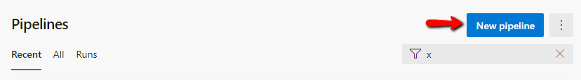

### Select `Azure Repos Git`

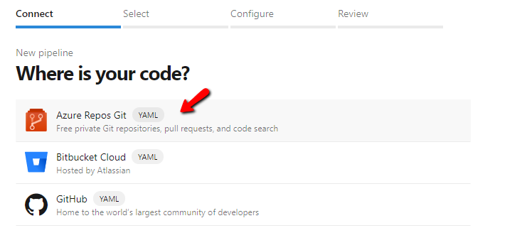

### Select your repo

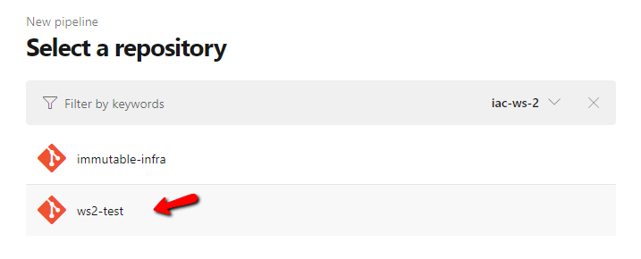

### Select `Existing Azure Pipelines YAML file`

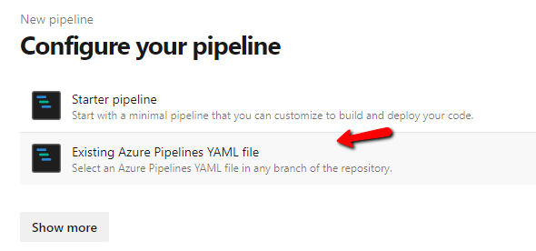

### Select branch and yaml file 

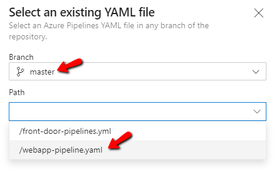

### Save pipeline

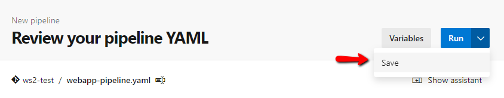

By default, pipeline will have the name of the repository, therefore we need to rename it.

### Navigate to `All` and select `Rename/move` from the drop down context menu

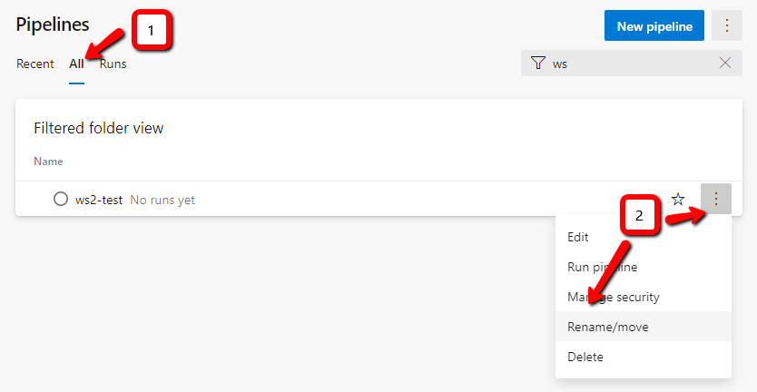

### Give pipeline a name and save it

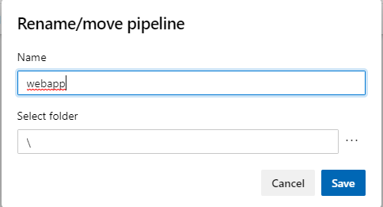

### Run pipeline

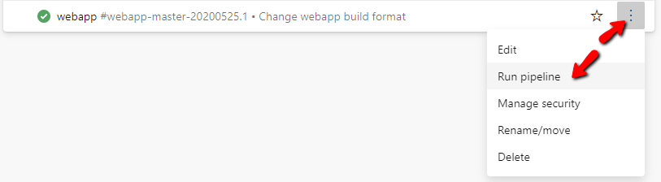

### Check that it publishes artifacts

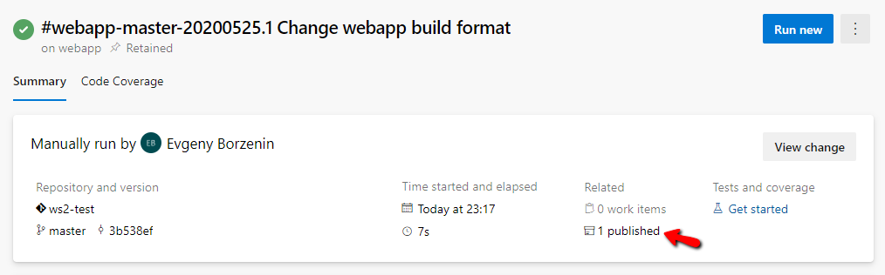

### And artifacts contain `webapp` files

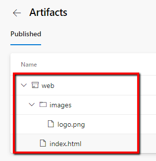

## Task #3 - test build trigger

Now let's test that build automatically starts when we change `webapp` content. Change something in `index.html` file, commit and push.

```bash
git add .
git commit -m "Testing CI trigger"
git push
```

check that build started


## Task #4 - commit and push any un-committed changes

```bash
git add .
git commit -m "Finish lab-09"
git push
```

## Next

[Go to lab-10](../lab-10/readme.md)
