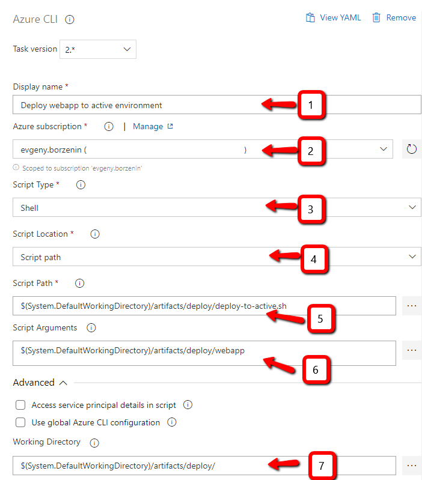

# Lab-10 - create webapp release pipeline

CI/CD pipeline for our webapp will consists of 2 steps:

* build that will publish webapp static content as Azure DevOps artifacts
* release that will take build artifacts and deploys them to the selected environment

The gaol for this lab is to implement YAML based build pipeline

## Estimated completion time - x min

## Useful links

* [What is Azure Pipelines?](https://docs.microsoft.com/en-us/azure/devops/pipelines/get-started/what-is-azure-pipelines?view=azure-devops)
* [Use Azure Pipelines](https://docs.microsoft.com/en-us/azure/devops/pipelines/get-started/pipelines-get-started?view=azure-devops)
* [Key concepts for new Azure Pipelines users](https://docs.microsoft.com/en-us/azure/devops/pipelines/get-started/key-pipelines-concepts?view=azure-devops)
* [Artifacts in Azure Pipelines](https://docs.microsoft.com/en-us/azure/devops/pipelines/artifacts/build-artifacts?view=azure-devops&tabs=yaml)

## Task #1 - create and configure `webapp` release pipeline

### Create new pipeline


### We will configure it from scratch, therefore click `Empty job`


### Give pipeline a name - `webapp` and add new artifact


### Configure artifact


* Use `Build` as a source type
* Select your Project
* Select your repo
* Set artifact alias to `artifacts` 
* Click `Add`

### Configure continuous trigger


* Click trigger icon
* Enable continuous deployment trigger
* Set branch to master

### Give the stage a name - `active`


### Select agent pool configuration and add new task


### Add Azure CLI task


### Configure Azure CLI task



* Set display name
* Select Azure Service Connection
* Set `Script type` to `Shell`
* Set `Script location` to `Script path`
* Set `Script path` to `$(System.DefaultWorkingDirectory)/artifacts/deploy/deploy-to-active.sh` (if you don't follow our convention, you may need to adjust the path)
* Set `Script Argument` to `$(System.DefaultWorkingDirectory)/artifacts/deploy/webapp` (if you don't follow our convention, you may need to adjust the path)
* Set `Working Directory` to `$(System.DefaultWorkingDirectory)/artifacts/deploy/` (if you don't follow our convention, you may need to adjust the path)

### Change release name format


### Save and start the release

## Task #2 - commit and push any un-committed changes

```bash
git add .
git comment -m "Finish lab-08"
git push
```

## Next

[Go to lab-11](../lab-11/readme.md)
