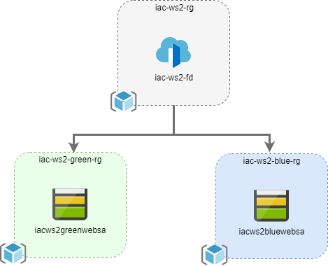

# Welcome to the second workshop in the series of hands-on Infrastructure as Code workshops

During the first workshop, we learned what ARM templates are and how to work with them. In this workshop you will use the knowledge and experience you learned from the first one and use it to implement simple immutable infrastructure with automated blue/green provision and deployment pipelines.

The goals for this workshop are:

* design and implement immutable infrastructure using ARM templates
* create an configure set of CI/CD pipelines for infrastructure provisioning and deployment

## Infrastructure architecture

* We will implement a very simple website with static content only
* We will use Azure Storage Account and it's static web site feature to host web site content.
* We will use Azure Front Door to orchestrate our traffic.

## Links

* [Prerequisites](prerequisites.md)
* [Agenda](agenda.md)
* [Test scenario](scenario.md)
* [Conventions](conventions.md)
