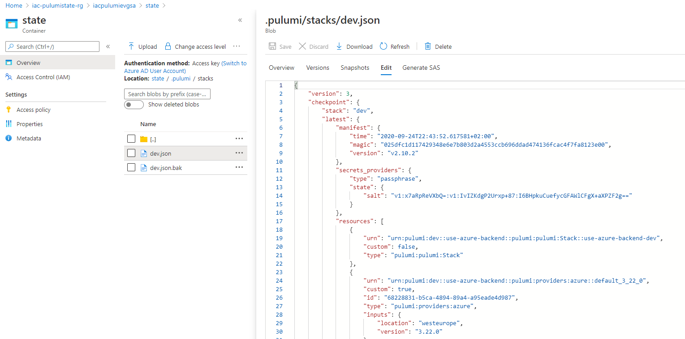
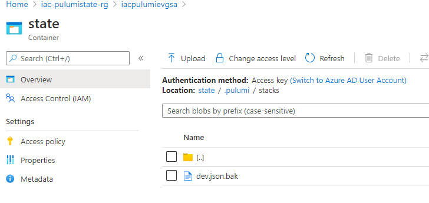

# lab-06 - persisting state at Azure Storage Account

## Estimated completion time - ?? min

Pulumi stores its own copy of the current state of your infrastructure and there are two state backend options available:

* The Pulumi Service backend
* A self-managed backend, either stored locally on filesystem or remotely using a cloud storage service, in our case, Azure Blob Storage

## Why using self-managed backend?

It might be several reasons why you want to store the state the storage you maintained yourself. One reason can be legal aspects. Pulumi Service backend is hosted at AWS in USA. So, it might be that you can't store your state outside of the EU. Or if you want to have full control over who has access to the state. In this case you can configure pulumi to store state at your backend and it supports multiple options, including Azure Blog storage that we will use in this lab.

Even though technically this is possible to store state at self-maintained backend, Pulumi doesn't recommend this for organizations as the Pulumi platform provides added security and governance functionality; plus requires more workarounds that need to be maintained over time and would otherwise be removed by using the Pulumi platform.

Please also read [Pulumi: Notes on self-managed backends](https://www.pulumi.com/docs/intro/concepts/state/#notes-on-self-managed-backends)
> Some commands may behave slightly differently when using the local or remote storage endpoint. For example, when connected to pulumi.com, pulumi up ensures there are no other updates in flight for a given stack. This doesn’t happen with self-managed backends. Pulumi also manages secrets using a key encrypted with a passphrase and stored in Pulumi.<stack-name>.yaml. This requires you enter the passphrase when you preview, update, or delete your stack. If you want to collaborate with another person, you’ll need to share this passphrase with them as well. All of these overhead tasks will have to be managed separately when you opt into the local or remote state backend.

## Goals

* Configure Pulumi to store state at Azure Storage Account

## Useful links

* [Pulumi: State and Backends](https://www.pulumi.com/docs/intro/concepts/state/)
* [Pulumi: Self-managed backends](https://www.pulumi.com/docs/intro/concepts/state/#self-managed-backends)
* [Pulumi: Notes on self-managed backends](https://www.pulumi.com/docs/intro/concepts/state/#notes-on-self-managed-backends)
* [pulumi login](https://www.pulumi.com/docs/reference/cli/pulumi_login/)
* [Using Pulumi on Azure Storage Accounts](https://cloud-right.com/2019/10/pulumi-azure-storage)
* [Storage account overview](https://docs.microsoft.com/en-us/azure/storage/common/storage-account-overview?WT.mc_id=AZ-MVP-5003837)
* [Quickstart: Create, download, and list blobs with Azure CLI](https://docs.microsoft.com/en-us/azure/storage/blobs/storage-quickstart-blobs-cli?WT.mc_id=AZ-MVP-5003837)

## Task #1 - create Storage account

Note!

Storage Account names **MUST** be globally unique. Do not use storage account name used in the code below, create your own name and I suggest the following convention: 

iacpulumi***usr***sa, where `usr` is short version of your username, in mya case I will use `iacpulumievgsa`

```bash
$ az group create --name iac-pulumistate-rg --location westeurope
$ az storage account create --name iacpulumievgsa --resource-group iac-pulumistate-rg --location westeurope --sku Standard_LRS --https-only true --kind StorageV2
$ KEYS=$(az storage account keys list --account-name iacpulumievgsa --resource-group iac-pulumistate-rg --output json)
$ export AZURE_STORAGE_ACCOUNT="iacpulumievgsa"
$ export AZURE_STORAGE_KEY=$(echo $KEYS | jq -r .[0].value)
$ az storage container create --name state
$ export PULUMI_CONFIG_PASSPHRASE="foobar"
```

Alternatively, you can set `AZURE_STORAGE_SAS_TOKEN` as  environment variable to access Storage Account.

Once you executed scripts you should be able to find an Azure Storage Container in your subscription.


## Task #2 - login to Azure backend

To configure Pulumi’s backend to the Azure Storage Container, run the following command

```bash
$ pulumi login azblob://state
```

Pulumi will use the environment variables `AZURE_STORAGE_ACCOUNT` and `AZURE_STORAGE_KEY` to authenticate to Azure Storage.

## Task #3 - create new stack

Now let's create a new stack and see what will happen at the Storage Account

```bash
$ mkdir use-azure-backend
$ cd use-azure-backend
$ pulumi new azure-csharp
$ pulumi new azure-csharp
This command will walk you through creating a new Pulumi project.

Enter a value or leave blank to accept the (default), and press <ENTER>.
Press ^C at any time to quit.

project name: (use-azure-backend)
project description: (A minimal Azure C# Pulumi program)
Created project 'use-azure-backend'

stack name: (dev)
Created stack 'dev'

azure:location: The Azure location to use: (WestUS) westeurope
Saved config

Installing dependencies...
```

Let's only keep resource group `iac-ws3-lab06-rg` at the stack 

```c#
...
class MyStack : Stack
{
    public MyStack()
    {
        // Create an Azure Resource Group
        var resourceGroup = new ResourceGroup("iac-ws3-lab06");
    }
}
...
```

and deploy it

```bash
$ pulumi up
Previewing update (dev):
     Type                         Name                   Plan
 +   pulumi:pulumi:Stack          use-azure-backend-dev  create
 +   └─ azure:core:ResourceGroup  iac-ws3-lab06          create

Resources:
    + 2 to create

Do you want to perform this update? yes
Updating (dev):
     Type                         Name                   Status
 +   pulumi:pulumi:Stack          use-azure-backend-dev  created
 +   └─ azure:core:ResourceGroup  iac-ws3-lab06          created

Resources:
    + 2 created

Duration: 11s
```

## Task #04 - check the stack state

Now, let's go over to your Azure Storage Account and check the content of our container. You should see a folder structure similar to the one in the following screenshot.


You can also check the content of the `dev.json` file and it should contain json file with stack state. 



This is the json you will get if you run the following command

```bash
$ pulumi stack export
{
    "version": 3,
    "deployment": {
        "manifest": {
            "time": "2020-09-24T22:43:52.617581+02:00",
            "magic": "025dfc1d117429348e6e7b803d2a4553ccb696ddad474136fcac4f7fa8123e00",
            "version": "v2.10.2"
        },
        "secrets_providers": {
            "type": "passphrase",
            "state": {
                "salt": "v1:x7aRpReVXbQ=:v1:IvIZKdgP2Urxp+87:I6BHpkuCuefycGFAWlCFgX+aXPZF2g=="
            }
        },
        "resources": [
            {
...
```

## Task #05 - destroy stack resources

```bash
$ pulumi destroy
Previewing destroy (dev):
     Type                         Name                   Plan
 -   pulumi:pulumi:Stack          use-azure-backend-dev  delete
 -   └─ azure:core:ResourceGroup  iac-ws3-lab06          delete

Resources:
    - 2 to delete

Do you want to perform this destroy? yes
Destroying (dev):
     Type                         Name                   Status
     Type                         Name                   Status
 -   pulumi:pulumi:Stack          use-azure-backend-dev  deleted
 -   └─ azure:core:ResourceGroup  iac-ws3-lab06          deleted

Resources:
    - 2 deleted

Duration: 53s
```

Now run the `stack export` command again

```bash

$ pulumi stack export
{
    "version": 3,
    "deployment": {
        "manifest": {
            "time": "2020-09-24T22:55:29.1379112+02:00",
            "magic": "025dfc1d117429348e6e7b803d2a4553ccb696ddad474136fcac4f7fa8123e00",
            "version": "v2.10.2"
        },
        "secrets_providers": {
            "type": "passphrase",
            "state": {
                "salt": "v1:x7aRpReVXbQ=:v1:IvIZKdgP2Urxp+87:I6BHpkuCuefycGFAWlCFgX+aXPZF2g=="
            }
        }
    }
}
```

and compare it with the content of the `dev.json` file at the Azure Blob


Now we can remove state by running the following command

```bash
$ pulumi stack rm dev
This will permanently remove the 'dev' stack!
Please confirm that this is what you'd like to do by typing ("dev"): dev
Stack 'dev' has been removed!
```

and if you check the Azure blob now, there will be no `dev.json` file any longer



## Next: working with configuration and secrets

[Go to lab-07](../lab-07/readme.md)
