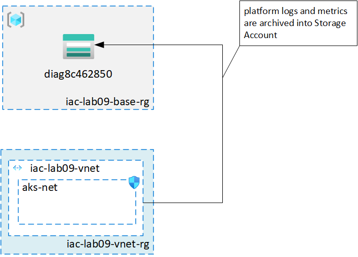

# lab-09 - working with inter-stack dependencies

## Estimated completion time - ?? min

When you work with complex infrastructure, you will most likely not put everything into one Pulumi project. You will structure your infrastructure resources followed by conventions and criteria used in your organization. Pulumi has a good set of ideas about how you can [organize your Projects and Stacks](https://www.pulumi.com/docs/intro/concepts/organizing-stacks-projects/).

When your resources are spread within several projects, you need a way to reference resources cross projects. In Pulumi they called it [Inter-Stack Dependencies](https://www.pulumi.com/docs/intro/concepts/organizing-stacks-projects/#inter-stack-dependencies).

## Goals

* Learn how Inter-Stack Dependencies work and how to use it in your projects.

## Useful links

* [Pulumi: programming model](https://www.pulumi.com/docs/intro/concepts/programming-model/)
* [Pulumi: Organizing Projects and Stacks](https://www.pulumi.com/docs/intro/concepts/organizing-stacks-projects/)
* [Pulumi: Inter-Stack Dependencies](https://www.pulumi.com/docs/intro/concepts/organizing-stacks-projects/#inter-stack-dependencies)
* [Pulumi: DiagnosticSetting reference](https://www.pulumi.com/docs/reference/pkg/azure/monitoring/diagnosticsetting/)
* [Create diagnostic settings to send platform logs and metrics to different destinations](https://docs.microsoft.com/en-us/azure/azure-monitor/platform/diagnostic-settings?WT.mc_id=AZ-MVP-5003837)

## Use-case description

Here is the typical scenario you need to implement when working on Azure. You have several resources deployed to different resource groups and you need to create diagnostic settings to send platform logs and metrics to different destinations.  Platform logs and metrics can be sent to:

* Log Analytics workspace
* Event hubs
* Azure storage account

Normally, you want to collect platform logs and metrics at one place

Here is the infrastructure model we want to implement in this lab.



There are 2 resource groups:

* `iac-lab09-base-rg` for "shared" resources, in our case it's `diag8c462850` - the diagnostics storage account
* `iac-lab09-vnet-rg` with `iac-lab09-vnet` private virtual network that is configured that platform logs and metrics are send to `diag8c462850` for archiving

There will be 2 Pulumi projects:

* `lab09-base` with storage account resource called `diag`. storage account id will be exposed as output called `DiagnosticsStorageAccountId`
* `lab09-vnet` with private virtual network resource called `iac-lab09-vnet`. To configure diagnostics settings we we will reference `lab09-base` and use `DiagnosticsStorageAccountId` to read storage account id.

## Task #1 - create project for diagnostic storage account

```bash
$ mkdir lab09-base
$ cd lab09-base
$ pulumi new azure-csharp
```

Add storage account resource into the stack and expose storage account id into output called `DiagnosticsStorageAccountId`.
Here is my version:

```c#
using Pulumi;
using Pulumi.Azure.Core;
using Pulumi.Azure.Storage;

class MyStack : Stack
{
    public MyStack()
    {
        // Create an Azure Resource Group
        var resourceGroup = new ResourceGroup("rg", new ResourceGroupArgs
        {
            Name = "iac-lab09-base-rg"
        });

        // Create an Azure Storage Account
        var storageAccount = new Account("diag", new AccountArgs
        {
            ResourceGroupName = resourceGroup.Name,
            AccountReplicationType = "LRS",
            AccountTier = "Standard"
        });

        // Export the connection string for the storage account
        this.DiagnosticsStorageAccountId = storageAccount.Id;
    }

    [Output]
    public Output<string> DiagnosticsStorageAccountId { get; set; }
}
```

and provision it

```bash
$ pulumi up
Previewing update (dev)

     Type                         Name            Plan       
 +   pulumi:pulumi:Stack          lab09-base-dev  create     
 +   ├─ azure:core:ResourceGroup  rg              create     
 +   └─ azure:storage:Account     diag            create     
 
Resources:
    + 3 to create

Do you want to perform this update? yes
Updating (dev)

     Type                         Name            Status      
 +   pulumi:pulumi:Stack          lab09-base-dev  created     
 +   ├─ azure:core:ResourceGroup  rg              created     
 +   └─ azure:storage:Account     diag            created     
 
Outputs:
    DiagnosticsStorageAccountId: "/subscriptions/.../resourceGroups/iac-lab09-base-rg/providers/Microsoft.Storage/storageAccounts/diagdbd23415"

Resources:
    + 3 created

Duration: 35s
```

## Task #2 - create project for private virtual network

```bash
$ mkdir lab09-vnet
$ cd lab09-vnet
$ pulumi new azure-csharp
```

Add private vnet resource called `iac-lab09-vnet` (10.0.0.0/16) with one subnet called `aks-net` (10.0.0.0/24) into the stack.

```c#
using Pulumi;
using Pulumi.Azure.Core;
using Pulumi.Azure.Network;

class MyStack : Stack
{
    public MyStack()
    {
        // Create an Azure Resource Group
        var resourceGroup = new ResourceGroup("rg", new ResourceGroupArgs{
            Name = "iac-lab09-vnet-rg"
        });

        var vnet = new VirtualNetwork("vnet", new VirtualNetworkArgs
        {
            Name = "iac-lab09-vnet",
            ResourceGroupName = resourceGroup.Name,
            Location = resourceGroup.Location,
            Name = "iac-pulumi-import-vnet",
            AddressSpaces = { "10.0.0.0/16" }
        });

        var aksSubNet = new Subnet("aks", new SubnetArgs
        {
            Name = "aks",
            ResourceGroupName = resourceGroup.Name,
            VirtualNetworkName = vnet.Name,
            AddressPrefixes = { "10.0.0.0/24" }
        });
    }
}
```

and provision it

```bash
$ pulumi up
Previewing update (dev)

     Type                             Name            Plan       
 +   pulumi:pulumi:Stack              lab09-vnet-dev  create     
 +   ├─ azure:core:ResourceGroup      rg              create     
 +   ├─ azure:network:VirtualNetwork  vnet            create     
 +   └─ azure:network:Subnet          aks             create     
 
Resources:
    + 4 to create

Do you want to perform this update? yes
Updating (dev)

     Type                             Name            Status      
 +   pulumi:pulumi:Stack              lab09-vnet-dev  created     
 +   ├─ azure:core:ResourceGroup      rg              created     
 +   ├─ azure:network:VirtualNetwork  vnet            created     
 +   └─ azure:network:Subnet          aks             created     
 
Resources:
    + 4 created

Duration: 28s
```

If you check `Diagnostics settings` for newly created Vnet you can find that it's not yet configured.


## Task #3 - add diagnostics settings

To add diagnostics settings to the resource you should use [DiagnosticSetting](https://www.pulumi.com/docs/reference/pkg/azure/monitoring/diagnosticsetting/) class and specify:

* `TargetResourceId` - resource id of the resource you want to configure diagnostics dor
* `StorageAccountId` - diagnostics Storage account id
* `Logs` and `Metrics` - configure what kind of performance logs and metrics we want to collect and their retention policies

We need storage account id from `lab09-base` project, therefore we need to add a stack reference to the `dev` stack from `lab09-base` project.
The StackReference constructor takes as input a string of the form `<organization>/<project>/<stack>`, and lets you access the outputs of that stack.
In my case, the stack reference will be `evgenyb/lab09-base/dev`, but for you it will be different.

```c#
var baseResources = new StackReference("evgenyb/lab09-base/dev");
```

Once we have that resource, we can fetch the `DiagnosticsStorageAccountId` output variable with the `RequireOutput` function.

```c#
StorageAccountId = baseResources.RequireOutput("DiagnosticsStorageAccountId").Apply(x => x.ToString())
```

Here is the code that configures DiagnosticSetting for vnet

```c#
var baseResources = new StackReference("evgenyb/lab09-base/dev");
var diagnosticSetting = new Pulumi.Azure.Monitoring.DiagnosticSetting("diagnostics", new Pulumi.Azure.Monitoring.DiagnosticSettingArgs
{
    TargetResourceId = vnet.Id,
    StorageAccountId = baseResources.RequireOutput("DiagnosticsStorageAccountId").Apply(x => x.ToString()),
    Metrics =
    {
        new Pulumi.Azure.Monitoring.Inputs.DiagnosticSettingMetricArgs
        {
            Category = "AllMetrics",
            RetentionPolicy = new Pulumi.Azure.Monitoring.Inputs.DiagnosticSettingMetricRetentionPolicyArgs
            {
                Enabled = false,
            }
        }
    }
});
```

In the above example, I configured that I want to send all metrics and I no need any retention policy.

deploy it

```bash
$ pulumi up
Previewing update (dev)

     Type                                   Name            Plan       
     pulumi:pulumi:Stack                    lab09-vnet-dev             
 +   └─ azure:monitoring:DiagnosticSetting  diagnostics     create     
 
Resources:
    + 1 to create
    4 unchanged

Do you want to perform this update? yes
Updating (dev)

     Type                                   Name            Status      
     pulumi:pulumi:Stack                    lab09-vnet-dev              
 +   └─ azure:monitoring:DiagnosticSetting  diagnostics     created     
 
Resources:
    + 1 created
    4 unchanged

Duration: 11s
```


Click `Edit settings` to verify that only Metrics are configured


## Task #4 - cleanup

As always, don't forget to remove resources

Destroy resources and remove stack for `lab09-base` project

```bash
$ cd lab09-base
$ pulumi destroy --yes
$ pulumi stack rm --yes
```

Destroy resources and remove stack for `lab09-vnet` project

```bash
$ cd lab09-vnet
$ pulumi destroy --yes
$ pulumi stack rm --yes
```

## Next: 

[Go to lab-10](../lab-10/readme.md)