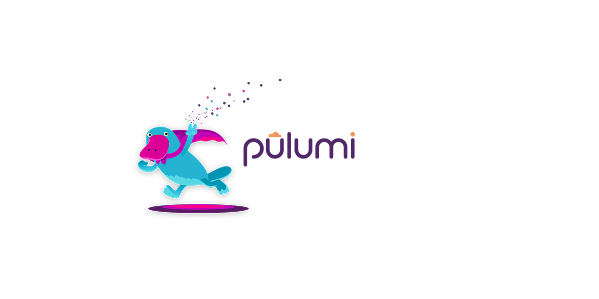

# Implement immutable infrastructure with Pulumi

Welcome to the third workshop at the series of workshop dedicated to Infrastructure as Code tools and frameworks. During the first 2 workshops we learned what are ARM templates and how to use them. This time we will look at Pulumi - an open source infrastructure as code tool for creating, deploying, and managing cloud infrastructure.

The original plan was to implement 2 workshops per tool:

1. Get started with `a tool`
2. Implement immutable infrastructure on Azure with `a tool`

 But it turned out that Pulumi is so easy to work with, that I decided to merge both workshops into one.

## Prerequisites

Please ensure you have completed the Workshop [prerequisites](prerequisites.md)

## Workshop goals

The goals for this workshop are:

* get started with Pulumi on Azure
* learn how to use Azure services like Storage Account and Key Vault  to self-manage the state and secrets management
* implement immutable infrastructure on Azure
* (??? if we have time) create an configure set of CI/CD pipelines for infrastructure provisioning and deployment

## Agenda

* 17:05 - 17:10 - welcome + practical info
* 17:10 - 17:15 - MS Azure Badges
* Infrastructure as Code
* Pulumi intro (slides - xx min)
* [lab-01](labs/lab-01/readme.md) - create new Project (xx min)
* [lab-02](labs/lab-02/readme.md) - working with the "flow" (xx min)
* [lab-03](labs/lab-03/readme.md) - working with Stacks (xx min)
* [lab-04](labs/lab-04/readme.md) - working with Stack Outputs (xx min)
* State and Backends (slides - xx min)
* [lab-05](labs/lab-05/readme.md) - persisting state at Azure Storage Account (xx min)
* [lab-06](labs/lab-06/readme.md) - working with configuration and secrets (xx min)
* [lab-07](labs/lab-07/readme.md) - managing secrets with Azure Key-Vault (xx min)
* [lab-08](labs/lab-08/readme.md) - import existing resources (xx min)
* lab-09 - working with inter-stack dependencies (xx min)
* Immutable Infrastructure + use-case introduction
* lab-10 - implement `blue` and `green` static websites (xx min)
* lab-11 - implement Azure FrontDoor to orchestrate canary traffic between `blue` / `green` slots  (xx min)

## Links

* [Pulumi](https://www.pulumi.com/)
* [Pulumi: Get Started with Azure](https://www.pulumi.com/docs/get-started/azure/)
* [Storage account overview](https://docs.microsoft.com/en-us/azure/storage/common/storage-account-overview?WT.mc_id=AZ-MVP-5003837)
* [About Azure Key Vault](https://docs.microsoft.com/en-us/azure/key-vault/general/overview?WT.mc_id=AZ-MVP-5003837)
