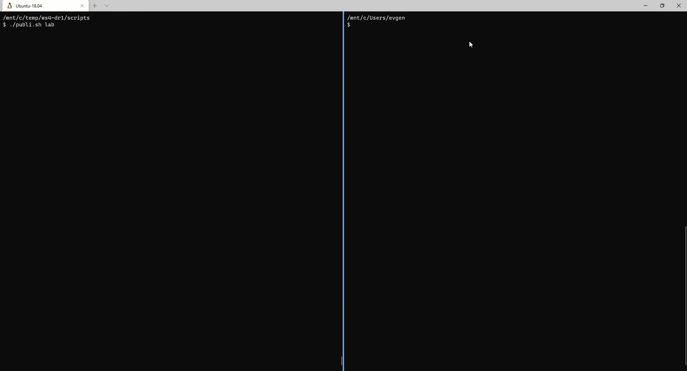

# lab-06 - implement master deployment script

## Estimated completion time - xx min

## Switch logic

There are deployment 2 slots at `workload` Stack: `active` and `next`.

`active` contains the name (or color `blue`|`green`) of the `workload` Stack, containing Azure function that is currently active and receive traffic.

`next` is the name (or color `blue`|`green`) of the `workload` Stack that next deployment will be deployed to.

During the switch the following activities should take place in the following order:

* read `ActiveSlot` and `NextSlot` Outputs from the `base` Stack
* destroy `workload` next Stack (we do it just to make sure that we have a clean deployment)
* deploy new version of Azure function to the `NextSlot` Stack
* update `active.slot` and `next.slot` configuration values of the `base` Stack:
  * set `active.slot` value to `NextSlot`
  * set `next.slot` value to `ActiveSlot`
* deploy `base` Stack

During `base` stack deployment, Azure Front Door backend endpoints will be updated the way that the endpoint receiving traffic will point to the Azure Function deployed to the `active.slot` Stack. In case of cussesfull switch, the Outputs values of `base` Stack will be updated and `ActiveSlot` will contain the name of the active slot and `NextSlot` will contain the name of the next slot.

## Goals

Implement deployment script that:

* deploys new version of  Azure function into the next deployment slot
* switch traffic at Azure Front Door to the new Azure function

## Task #1 - implement deployment script

Now you are the boss and feel free to implement the orchestration logic with the scripting tools you prefer to use. I am using bash and here is my `scripts/publi.sh` bash script.

Couple of notes:

* I added environment as a parameter. In real scenario it's very much likely you will have more than one environment
* Since I don't want to preview changes, I use `--skip-preview` and `--yes` flags of  `pulumi up` command to save some time
* Since now we operate from `scripts` folder, I use `-C` flag and specify relative path to the folder where project file are located
* I use `-c Release` when I build and publish Azure Function

```bash
#!/usr/bin/env bash

environment=$1

echo -e "Get active slot"
activeSlot=$(pulumi stack -s ${environment} output ActiveSlot -C ../infra/base)
nextSlot=$(pulumi stack -s ${environment} output NextSlot -C ../infra/base)
nextStack="${environment}-${nextSlot}"

echo -e "Active slot is $activeSlot"
echo -e "Next deployment slot is $nextSlot"

echo -e "Building Azure function..."
dotnet publish ../function/function.csproj --self-contained true -c Release  -o ../published

echo -e "Destroy $nextSlot slot (if exists)"
pulumi destroy -C ../infra/workload -s $nextStack --yes

echo -e "Deploy new version of azure function to $nextStack"
pulumi up --skip-preview -C ../infra/workload -s $nextStack --yes

echo -e "Configure Front Door"
pulumi config set active.slot $nextSlot -s ${environment} -C ../infra/base
pulumi config set next.slot $activeSlot -s ${environment} -C ../infra/base
pulumi up --skip-preview -s ${environment} -C ../infra/base --yes

timestamp=`date "+%Y%m%d-%H%M%S"`

echo -e "Done at ${timestamp}"
echo -e "Waiting 3 min for Front Door to deploy changes to Point Of Presence"
sleep 3m
timestamp=`date "+%Y%m%d-%H%M%S"`
echo -e "Done at ${timestamp}"
```

## Task #2 - deploy new version

```bash
$ ./publi.sh lab
```

Here is stripped version of my deployment. In my case it takes approx. 8 min. 5 out of them is waiting for Front Door to deploy changes tio POP.  



## Next: configure Azure DevOps release pipeline

[Go to lab-07](../lab-07/readme.md)
