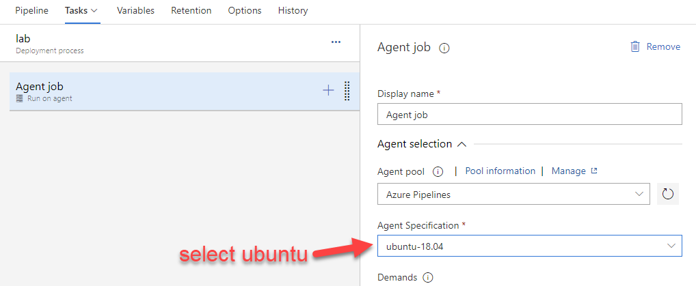
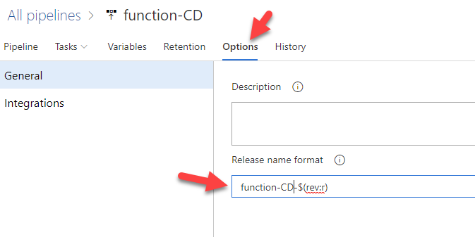
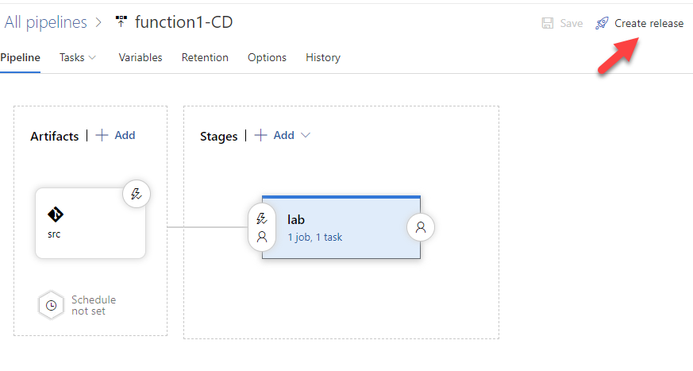

# lab-07 - create Azure DevOps release pipeline

## Estimated completion time - xx min

It's totally fine to deploy from local PC, but normally you want to have CI/CD pipelines that does the provisioning and deployment job.
It's many ways one can implement CI/CD pipeline strategy. 

## Goals

## Useful links

* [Pulumi: Azure DevOps](https://www.pulumi.com/docs/guides/continuous-delivery/azure-devops/)

## Task #1 - create classic release pipeline

### Create new class release pipeline


### Select `Empty job`


### Add artifact dependencies


1. Click Add artifact dependencies
2. Select Azure Repository
3. Select your project
4. Select your repository
5. Select master branch
6. Use `src` as an alias name

### Configure auto trigger


1. Click on trigger icon
2. Set it to `Enabled`
3. Trigger release only from the `master` branch

### Configure stage




### Add `az cli` task


1. Select your Service Connection
2. Select the type of the script
3. Use inline script
4. Enable `Access service principal details in script`

> This checkbox adds service principal id, service principal key and tenant id of the Azure endpoint you chose to the script's execution environment. You can use variables: servicePrincipalId, servicePrincipalKey and tenantId in your script.

5. Set your script working directory

### Add release Variables


Set `subscription_id` to your subscription id. You can mark it as Secret by clicking to the lock icon.
Set `pulumi_access_token` to you pulumi personal access token. You can generate one at this page https://app.pulumi.com/<your_user_name>/settings/tokens. Mark this variable as secret.

### Configure Environment Variables


Add 2 Environment variables: `PULUMI_ACCESS_TOKEN` and `ARM_SUBSCRIPTION_ID` and use release Variables `$(pulumi_access_token)` and `$(subscription_id)`.


Use this code as an inline script. Adjust it to your environment ()

```bash
echo -e "Setting up SPN"
export ARM_CLIENT_ID=$servicePrincipalId
export ARM_CLIENT_SECRET=$servicePrincipalKey 
export ARM_TENANT_ID=$tenantId

chmod +x $(System.DefaultWorkingDirectory)/src/scripts/publi.sh

echo -e "Installing or upgrading Pulumi"
curl -fsSL https://get.pulumi.com | sh

echo -e "Add Pulumi CLI to the PATH"
export PATH="$PATH:/home/vsts/.pulumi/bin"

echo -e "Run deployment"
./publi.sh lab
```

### (Optional) change the release name format



### Give release a name and save


## Task #2 - create new changes manually




Monitor the logs :)

## Task #3 - trigger the release by committing change to Azure function

Change something in the Azure function, for example the way how `responseMessage` is formatted.

```bash
git add .
git commit -m "Testing CICD"
git push
```

Observe your release pipeline. It should now start new release.

You have successfully completed all labs. Good job!

## Next: go and get some well deserved beer :)
