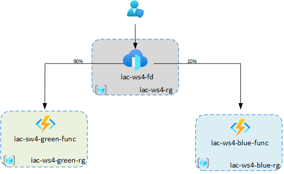

# Implement immutable infrastructure with Pulumi: Part II

Welcome to the forth workshop at the series of workshops dedicated to Infrastructure as Code tools and frameworks. 
[Last time](https://github.com/evgenyb/iac-meetup/tree/master/workshops/03-implement-immutable-infrastructure-on-azure-with-pulumi) we worked with `Pulumi` basics and learned how to work with Stacks, Configuration and secrets, how to deploy and destroy stacks and how to use inter-stack dependencies. 
This time, we will use this knowledge and implement simple immutable infrastructure with automated CI/CD pipelines.

## Prerequisites

Please ensure you have completed the Workshop [prerequisites](prerequisites.md)

## Workshop goals

* design and implement a simple immutable infrastructure using Pulumi
* create an configure set of CI/CD pipelines for infrastructure provisioning and application deployment

## Workshop use-case

During the workshop, we will implement very simple system that consists of Azure Function with Azure Front Door in front to orchestrate the traffic. Even though the setup looks simple, it will still give us enough challenges to get a good hands-on experience working with Pulumi.

## Agenda (this is subject to change)

* 17:05 - 17:10 - welcome + practical info
* 17:10 - 17:15 - Microsoft Azure Heroes program
* Use-case introduction (slides xx min)
* [lab-01](labs/lab-01/readme.md) - setting up the Projects and Stacks structure (xx min)
* [lab-02](labs/lab-02/readme.md) - add AppInsight into the base Project (xx min)
* [lab-03](labs/lab-03/readme.md) - implement simple Azure Function (xx min)
* [lab-04](labs/lab-04/readme.md) - add Azure Function infrastructure into the `workload` Project (xx min)
* Azure Front Door intro (slides xx min)
* [lab-05](labs/lab-05/readme.md) - add Azure Front Door infrastructure into the `base` Project (xx min)
* [lab-06](labs/lab-06/readme.md) - implement master deployment script (xx min)

CI/CD with Azure DevOps

* lab-07 - configure build pipeline for Azure Function (xx min)
* lab-08 - configure release pipeline (xx min)
